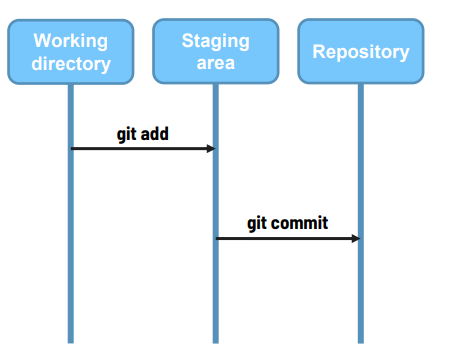
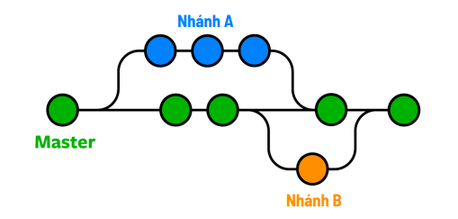

# Document Git
## Các thuật ngữ trong git

Working directory(Thư mục làm việc):Khu vực chứa dự án mà chúng ta đang làm việc.
Staging area (Khu vực sắp xếp):Khu vực chứa thông tin thay đổi của các file.
Repository (Kho lưu trữ): Kho lưu trữ để lưu trữ dữ liệu, lịch sử các phiên bản
## Các câu lệnh phổ biến trong Git
```bash
git --version
```
Xem phiên bản GIT hiện tại đang được cài trên máy tính
```bash
git init
```
Khởi tạo repository (kho lưu trữ) cho dự án.
Chạy câu lệnh trong thư mục gốc của dự án
```bash
git status
```
Để xem trạng thái của những file đã được thay đổi trong dự án
```bash
git add ten_file || git add . 
```
Chuyển các file đã thay đổi từ vùng Working sang vùng Staging.
Staging area có tác dụng sắp xếp lại những file đã thêm vào.
```bash
git commit -m "Nội dung… "
```
Chuyển các file từ vùng Staging sang vùng Repository.
Repository có tác dụng tạo ra 1 phiên bản mới.
```bash
git log
```
Xem lại lịch sử các commit.
Commit mới sẽ hiện bên trên, commit cũ sẽ hiện bên dưới.
```bash
git show commit_id
```
Dùng để xem chi tiết một commit.
```bash
git diff
```
Xem sự thay đổi của một file sau khi chỉnh sửa.
Điều kiện là file đó vẫn đang ở khu vực Working.
```bash
gitk
```
Mở dashboard xem trực quan hơn.
```bash
git checkout --ten_file
```
Bỏ đi những thay đổi của file, để file đó trở về như lúc ban đầu
Áp dụng cho file đang ở vùng Working.
```bash
git reset HEAD ten_file || git reset ten_file
```
Chuyển file đó từ vùng Staging trở lại vùng Working
```bash
git reset --soft commit_id
```
Chuyển từ trạng thái đã commit về trạng thái trước lúc chạy lệnh git commit.
Tức là từ Repository về lại Staging.
```bash
git reset --mixed commit_id
```
Chuyển từ trạng thái đã commit về trạng thái trước lúc chạy lệnh git add
Tức là từ Repository về lại Working.
### Nhánh trong git
Các nhánh đại diện cho các phiên bản của một kho lưu trữ tách ra từ dự án chính.
Nhánh master là nhánh chính, để sau này deploy lên server.

```bash
git branch
```
Xem danh sách các nhánh
```bash
git checkout -b ten_nhanh
```
Tạo một nhánh mới và chuyển sang nhánh đó.
```bash
git checkout ten_nhanh
```
Chuyển sang nhánh khác.
```bash
git merge ten_nhanh
```
Để merge nhánh khác vào trong nhánh hiện tại.
```bash
git branch -D ten_nhanh
```
Để xóa nhánh.
## Để đẩy code lên github khi chưa có git
```bash
git init
git add .
git commit -m "Nội dung commit"
git branch -M "tên nhánh mới"
git remote add origin url_github
git push -u orgin "tên nhánh"
```
## kéo code từ github về máy
```bash
git pull origin tên_nhánh
```